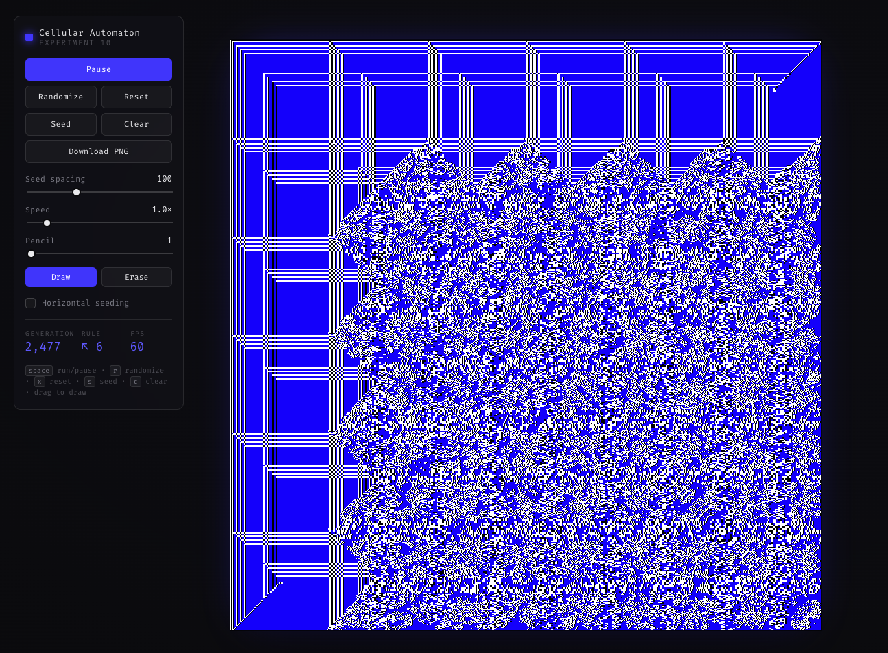
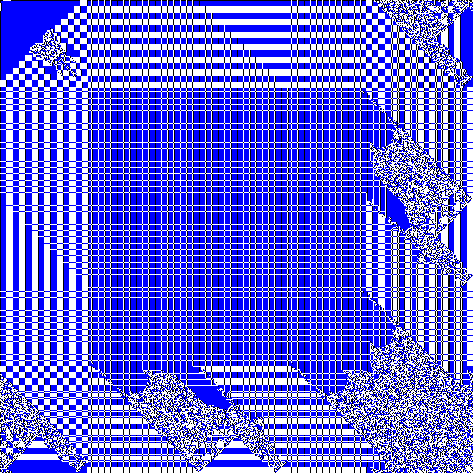
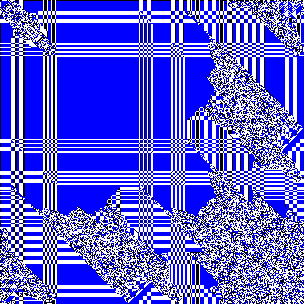
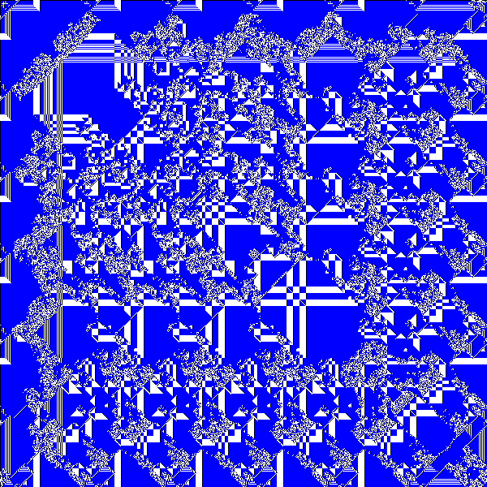
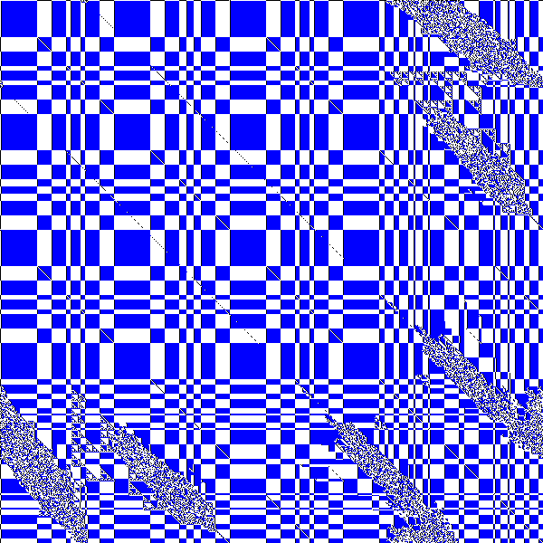
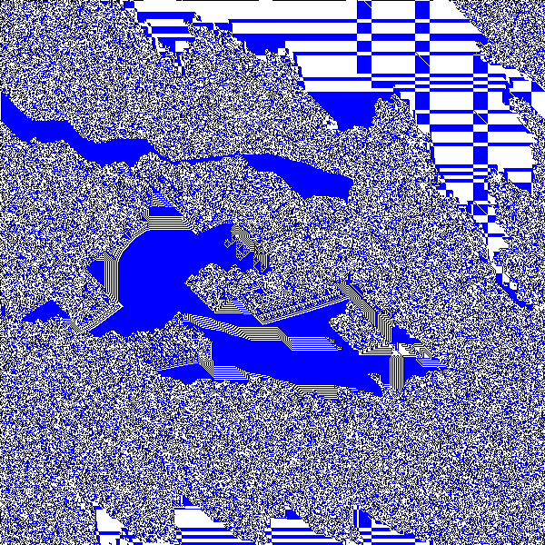
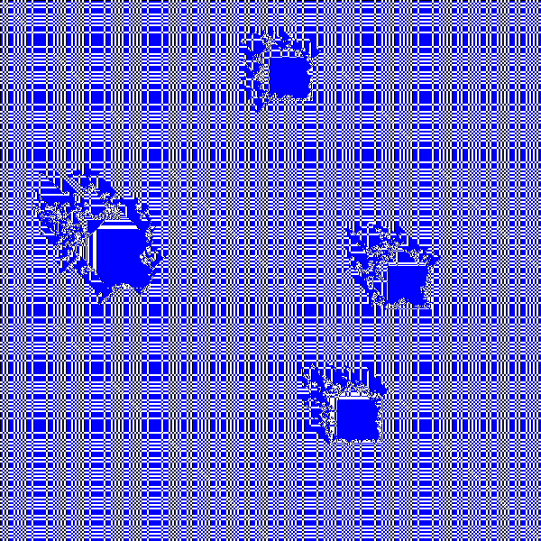
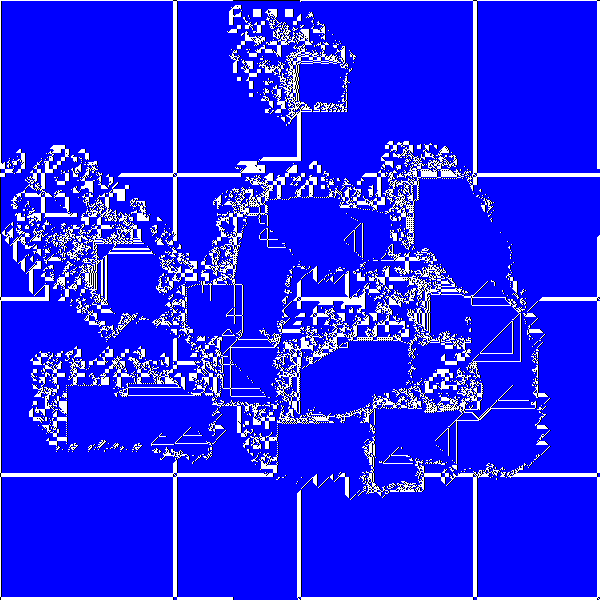
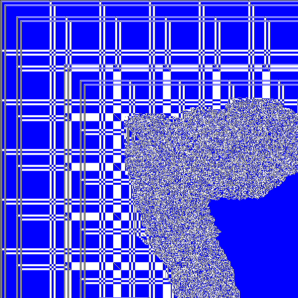
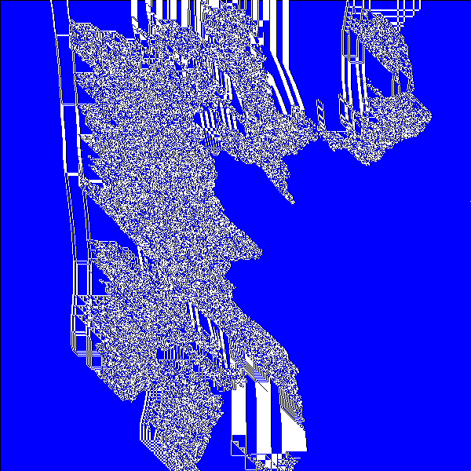

# CA · experiment 10 — web port

A modified Game of Life on a 600×600 grid with a blue / black / white colouring
rule — a plaid of hard rails that dissolves into organic noise. Built with
**TypeScript** and **[thi.ng/umbrella](https://github.com/thi-ng/umbrella)**: a
declarative reactive shell (atom + streams + rdom) around a tight typed-array
kernel, because that's where the speed actually lives.

**[▶︎ Run it live](https://m9dfukc.github.io/cellular-automaton-generator/)** — drag to draw · press `r` for a new rule · **Download PNG** to keep a frame



## Backstory

This started life around **2016** as a Processing sketch — `sketch_10`, one in a
series of quick cellular-automaton experiments. The rule is Conway's Game of Life
_"slightly modified ;)"_: alongside the usual survival check, each cell copies its
top-left neighbour, and a living cell is tinted **blue** when the cell to its left
is also alive. The result is neither the usual Life soup nor a clean fractal.

This repo is that sketch revamped as modern web tech — the same rule, bit for bit,
now running in the browser on a typed-array core, with interactive rule controls,
freehand drawing, and still-image export. The original lives on as a reference:
[`sketch_10_ca_experiment_optimized.pde`](docs/legacy/sketch_10_ca_experiment_optimized.pde).

## Gallery

Still frames exported straight from the app with **Download PNG** — different
rules from the Randomize pool, caught at different generations.

<p>
  
  
  
  
  
  
  
  
  
</p>

## Run

```bash
yarn install
yarn dev          # http://localhost:5173

yarn build        # normal chunked dist/
yarn build:single # one self-contained dist/index.html (no external requests)
yarn test         # verifies the engine is bit-exact vs the original sketch
```

## Controls

| Action            | Input                                                                                                     |
| ----------------- | --------------------------------------------------------------------------------------------------------- |
| Run / pause       | `space` or the Run button                                                                                 |
| Step one frame    | `n` or Step ▶ — advance a single generation (only while paused; disabled during run)                      |
| Randomize rule    | `r` or Randomize — random rule, **keeps the current buffer** so it keeps evolving under the new algorithm |
| Reset             | `x` or Reset — restore the original rule + defaults, then reseed                                          |
| Seed              | `s` or Seed — lay down the first-frame seed pattern, keeping the current rule                             |
| Clear stage       | `c` or Clear — empty the grid completely (draw your own)                                                  |
| Download frame    | Download PNG — saves the current canvas as `ca-experiment-gen<N>-<hash>.png`                              |
| Draw / erase cell | drag (or click) on the canvas                                                                             |
| Pencil size       | slider, 1–48 cells (square brush, strokes interpolated)                                                   |
| Draw / erase mode | Draw / Erase segmented toggle                                                                             |
| Seed spacing      | slider, 2–300 (`distProbability`)                                                                         |
| Horizontal seed   | checkbox (`stripesB`)                                                                                     |
| Speed             | slider, 0.1–8× — generations per frame (< 1 = slow motion)                                                |
| Auto re-seed      | checkbox — re-seed patches that have dissolved into noise (experimental, off by default)                  |
| Noise threshold   | slider, 0.50–1.00 — the patch entropy at which auto re-seed kicks in                                      |

The **rule** readout shows the active algorithm as `<reference-direction arrow> <survival-threshold>` (e.g. `↖ 6`, the original). Randomize draws from a curated pool of 8 rules — the four diagonal reference directions (↖ ↗ ↙ ↘) at survival 6–7 — and never repeats the current rule; Reset returns to `↖ 6`.

## Auto re-seed (experimental)

Left alone, some rules eventually chew their weave into featureless pixel noise.
The **Auto re-seed** toggle fights that: every 30 generations the grid is split
into 75×75-cell patches and each is scored by the Shannon entropy of its 2×2
block patterns, normalised to 0..1 (1 = all 16 patterns equally likely). Lattices
reuse a handful of patterns and score low; noise approaches 1. Patches at or
above the **Noise threshold** get re-seeded in place, so the pattern regenerates
locally instead of decaying. The `entropy` readout shows the highest patch score
from the last scan — useful for finding the threshold by eye, though it only
moves while the toggle is on (the scan doesn't run otherwise).

## How it maps to the original

Faithful to the [source sketch](docs/legacy/sketch_10_ca_experiment_optimized.pde),
including its quirky **mixed edge behaviour**: left/top neighbours **clamp**,
right/bottom neighbours **wrap**. The rules, seeding (`populate`), and the
left-neighbour blue colouring are reproduced exactly — `yarn test` diffs grid
state _and_ pixel output against a naive reference port of the `.pde` across
several configs and many generations. The original's hard-coded top-left
reference and `sum < 6` survival are the **defaults** of the now-tunable rule, so
the default behaviour is bit-identical.

## Where the performance comes from

- **Flat `Uint8Array` grids, double-buffered.** No `int[][]`, no per-generation
  allocation — the next state is written into a second buffer and the two
  references are swapped (O(1)).
- **Precomputed neighbour index maps.** The clamp/wrap edge rules are baked into
  four small `Int32Array`s, so the inner loop is branch-free at the borders.
- **Fused update + render.** At speed = 1 a single pass advances the generation
  _and_ writes pixels (`step()`); extra sub-steps use the draw-free `process()`.
- **Direct framebuffer.** Pixels go straight into a `@thi.ng/pixel` `ABGR8888`
  buffer whose `Uint32Array` maps 1:1 onto canvas `ImageData`, so the blit is one
  `putImageData`.

Measured in V8: ~4 ms per fused generation at 360k cells (~240 gen/s capacity),
i.e. comfortably above 60 fps with headroom for multi-step speeds.

## thi.ng packages used

- `@thi.ng/atom` — config state container
- `@thi.ng/rstream` — RAF loop, atom-derived streams, DOM events
- `@thi.ng/rstream-gestures` — pointer drawing
- `@thi.ng/rdom` — declarative, reactively-bound control UI
- `@thi.ng/transducers` — `map` / `dedupe` for derived streams
- `@thi.ng/equiv` — value equality for those `dedupe`s (reference equality re-fires them)
- `@thi.ng/pixel` — `ABGR8888` framebuffer + canvas blit

## Layout

```
src/
  ca.ts       typed-array engine (kernel, double buffer, framebuffer)  ← the fast core
  entropy.ts  patch entropy scan — noise detection behind auto re-seed
  state.ts    reactive atom + readout streams
  app.ts      loop, gestures, keyboard, reactions, declarative rdom UI
  main.ts     entry
  style.css   instrument HUD
test/
  verify.ts   bit-exact correctness check vs the original sketch
  bench.ts    kernel benchmark
```

## License

Both the source code and the images (the screenshot and the exported frames) are
released under **[CC BY-NC-SA 4.0](https://creativecommons.org/licenses/by-nc-sa/4.0/)**
(Attribution — NonCommercial — ShareAlike): use, remix, and share them — credit the
source, don't sell them, and keep derivatives under the same terms.
